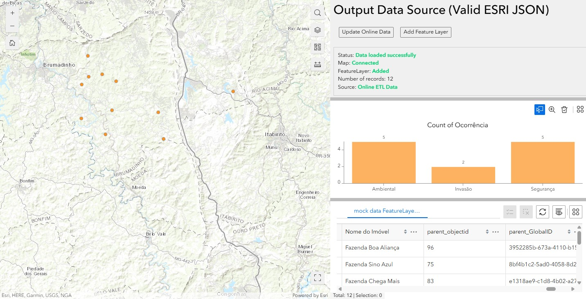

# Output Data Source ETL

A custom widget for ArcGIS Experience Builder that enables the extraction, transformation, and loading (ETL) of data with a specific schema for map visualization.

*The widget showing data loaded successfully from an Online ETL Data source with feature points displayed on a map and a chart showing occurrence counts.*

## Description

This widget allows you to connect to external data sources, process data according to a predefined schema, and display them as feature layers on ArcGIS maps. The widget supports:

- Connection to online ETL data sources
- Visualization of data as points on a map
- On-demand online data updates
- Addition of feature layers to the map

## Features

- **Data Connection**: Establishes connection with external data sources using authentication tokens
- **Data Visualization**: Renders data points on the map as a feature layer
- **Pop-up Windows**: Configures custom pop-ups to display feature attributes
- **Data Updates**: Allows manual data updates via the user interface
- **Schema Support**: Works with a predefined schema to ensure data consistency
- **Data Analysis**: Shows count of occurrences by category in chart format

## Requirements

- ArcGIS Experience Builder version 1.17.0 or higher
- Dependency: jimu-arcgis

## Configuration

The widget can be configured through the settings page, where you can define:

- Output data sources
- Connection settings
- Visualization parameters

## How to Use

1. Add the widget to your Experience Builder application
2. Configure the output data sources
3. Connect it to a map widget for visualization
4. Use the "Update Online Data" and "Add Feature Layer" buttons to manage data

## Development

Developed by `Hildermes` to demonstrate how to use and Output Datasource integration of ETL data with ArcGIS Experience Builder applications.
